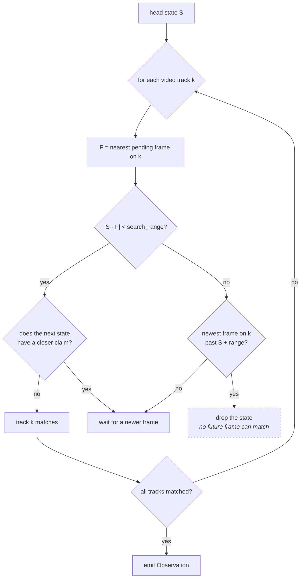

<picture>
  <source media="(prefers-color-scheme: dark)" srcset="/.github/banner_dark.png">
  <source media="(prefers-color-scheme: light)" srcset="/.github/banner_light.png">
  
</picture>

<h1 align="center">LiveKit Portal</h1>

<p align="center">
  <a href="https://github.com/livekit/portal/actions/workflows/tests.yml"></a>
  <a href="https://pypi.org/project/livekit-portal/"></a>
  <a href="LICENSE"></a>
  <a href="https://www.python.org/downloads/"></a>
</p>

<p align="center">
  
</p>

<!--BEGIN_DESCRIPTION-->
<p align="center"><b>Teleoperate, run policies, and record demonstrations against the same robot, from anywhere on the internet, with multiple operators in the room at once.</b> Portal carries cameras, joint state, and actions over LiveKit's room model. A policy and a human teleoperator can join the same session and hand off control mid-session with one call. Synchronized <code>(frames, state, timestamp)</code> observations arrive on the control side. Works with any robotics stack, with an optional <a href="https://github.com/huggingface/lerobot">LeRobot</a> plugin.</p>
<!--END_DESCRIPTION-->

<p align="center">
  <a href="docs/01-quickstart.md">Quickstart</a> ·
  <a href="docs/02-concepts.md">Concepts</a> ·
  <a href="docs/03-portal-api.md">Portal API</a> ·
  <a href="docs/">All docs</a> ·
  <a href="#examples">Examples</a>
</p>

---

## What it does

Your robot is on one machine. Your policy or teleop UI is on another, possibly on
another continent. Portal makes the second one look like it is holding the first.

```python
# Operator side. Cameras and joint state arrive already fused.
def on_observation(obs):
    action = policy(obs.frames["cam1"], obs.state)
    op.send_action(action, in_reply_to_ts_us=obs.timestamp_us)

op.on_observation(on_observation)
await op.connect(url, token)
await op.set_active_operator(op.local_identity())
```

That fusion is the point. Robotics policies want one bundle per tick, and no
transport delivers data that way. Video rides an encoder and a
congestion-controlled channel. State packets ride neither. They arrive out of
phase, typically 30 to 80 ms apart.

Portal stamps every frame and state packet with the sender's clock, then matches
them on the receiving side into `Observation(frames, state, timestamp_us)`.

Full walkthrough in [Quickstart](docs/01-quickstart.md).

## Features

**Multi-operator sessions.** A robot, policies, humans, recorders, and supervisors
all join one room. The robot listens to whichever operator holds control, and
everyone else streams silently and is dropped at the gate. Handoff is
`await op.set_active_operator("human-binh")` from any participant. Built on
LiveKit participant attributes plus one RPC method.

**Human in the loop.** Policy drives, human takes over to demonstrate a
correction, policy resumes. The robot's stream of executed actions stays
continuous across the cutover.

**HITL data recording.** A passive operator joins with
`set_action_subscription(True)` and receives every executed action, labeled with
`action.sender` and paired with its observation. About 50 lines.

**Built for VLA inference.** Action chunks ship a `(horizon, n_fields)` tensor in
one payload over a byte stream, with no 15 KB cap. Stamp actions with
`in_reply_to_ts_us` and `metrics.policy.e2e_us_p95` gives you true
observation-to-action latency rather than ping.

**Pixel-exact video when you need it.** WebRTC video is lossy and resamples
colorspace. For inference where pixels matter, pass `RAW`, `PNG`, or `MJPEG` to
[`add_video`](docs/05-frame-video.md) and each frame ships whole over a reliable
byte stream. Same API, RGB on both ends. MJPEG q=90 sustains 30 fps at 720p.

**Works with any stack.** Role-specific `Robot` and `Operator` classes in Python
over a unified `Portal` core in Rust. The optional
[lerobot](https://github.com/huggingface/lerobot) plugins are a convenience layer
on top, not the way in.

**Low-latency transport.** WebRTC video with SIMD RGB to I420 conversion. SCTP
data channels, reliable or unreliable per stream. Byte streams for arbitrary
payloads. RPC for one-shots. Rust core, Python bindings via UniFFI.

## Install

```bash
pip install livekit-portal      # or: uv add livekit-portal
```

Prebuilt wheels cover CPython 3.12 on Linux x86_64 (glibc 2.35 and newer), Linux
aarch64 (glibc 2.39 and newer), and macOS Apple Silicon. On anything else, build
from source. The library itself supports Python 3.10 and up.

Already on lerobot? `pip install lerobot-robot-livekit` and
`pip install lerobot-teleoperator-livekit`. See
[lerobot plugins](docs/reference/lerobot.md).

<details>
<summary>Build from source</summary>

You need a [Rust toolchain](https://rustup.rs/) and
[`uv`](https://docs.astral.sh/uv/).

```bash
git clone https://github.com/livekit/portal.git
cd portal

bash scripts/build_ffi_python.sh release
cd python && uv sync
```

`build_ffi_python.sh` compiles the `livekit-portal-ffi` cdylib and generates the
UniFFI Python bindings. The first build takes a few minutes. Rerun it whenever the
Rust code changes.

</details>

## Examples

Running an example is the fastest way to a known-good setup. All of them live
under [`examples/python/`](examples/python).

| Example | Hardware | What it shows |
|---|---|---|
| [`basic/`](examples/python/basic) | none | The whole API end to end, with synthetic video. Also ships a YAML-config variant. Start here. |
| [`inference/`](examples/python/inference) | none | A VLA-shaped loop using action chunks and true end-to-end latency metrics. |
| [`modal-mock-inference/`](examples/python/modal-mock-inference) | none | Runs the policy on [Modal](https://modal.com) and measures real glass-to-glass latency with a QR clock. |
| [`so101/`](examples/python/so101) | 2x SO-101 | A physical SO-101 follower driven by a remote SO-101 leader, rendered in [rerun](https://rerun.io). |

```bash
cd examples/python/basic
cp .env.example .env            # fill in LIVEKIT_URL / API_KEY / API_SECRET
uv sync
uv run robot.py                 # terminal 1
uv run teleoperator.py          # terminal 2
```

## How the sync works

Every outgoing frame and state packet carries the sender's monotonic clock. On the
control side, a per-session `SyncBuffer` matches them by that timestamp.



The real implementation is amortized `O(N + M)` via two-pointer cursors and
blocker-gated short-circuiting, with `O(1)` unmatchability detection. Full
walkthrough in [Synchronization](docs/reference/synchronization.md).

## Multi-operator and HITL

A Portal session is a room. The robot listens to one operator at a time, named by
an attribute it publishes. Everyone else's actions are dropped at the gate.
Handoff is one call from any participant.

```python
# Policy is driving. A human takes over to demonstrate a correction.
await human.set_active_operator(human.local_identity())
# ... teleoperate for a while ...
await human.set_active_operator("policy-v1")
```

Five patterns fall out of that, from a single operator through shadow evaluation
and supervisor arbitration. They are tabulated in
[Portal API](docs/03-portal-api.md#multi-operator-patterns), with working versions
in the [integration tests](python/packages/livekit-portal/tests/integration).

## Why LiveKit

Teleoperation over a WAN is a networking problem before it is a robotics problem.
Low-latency video and control data have to cross NAT, asymmetric bandwidth,
jitter, and loss. WebRTC was built for exactly that, and
[LiveKit](https://livekit.io/) wraps it in a production SFU with clean SDKs.

Concretely, Portal gets rooms with N participants for free, so a robot plus two
operators plus a recorder is the same code path as 1:1. It gets server-managed
participant attributes, which is where the active-operator pointer lives. It gets
cross-participant RPC, cross-language SDKs so a browser teleop UI speaks the same
protocol as the robot host, and the choice between
[LiveKit Cloud](https://livekit.io/cloud) and self-hosting.

Running on one machine or a LAN-only robot? You do not need any of this. A direct
socket is enough.

## Documentation

Start with the [docs index](docs/) for a guided path.

**Start here:** [Quickstart](docs/01-quickstart.md) ·
[Concepts](docs/02-concepts.md) · [Portal API](docs/03-portal-api.md)

**Then as needed:** [Tuning](docs/04-tuning.md) ·
[Frame video](docs/05-frame-video.md) · [RPC](docs/06-rpc.md) ·
[Metrics](docs/07-metrics.md) · [Troubleshooting](docs/08-troubleshooting.md)

**Reference:** [Config from YAML](docs/reference/config-file.md) ·
[E2EE](docs/reference/e2ee.md) ·
[Synchronization](docs/reference/synchronization.md) ·
[Wire protocol](docs/reference/wire-protocol.md) ·
[lerobot plugins](docs/reference/lerobot.md)

## License

Apache-2.0. See [LICENSE](LICENSE) for details.

<br/><table>

<thead><tr><th colspan="2">LiveKit Ecosystem</th></tr></thead>
<tbody>
<tr><td>Agents SDKs</td><td><a href="https://github.com/livekit/agents">Python</a> · <a href="https://github.com/livekit/agents-js">Node.js</a></td></tr><tr></tr>
<tr><td>LiveKit SDKs</td><td><a href="https://github.com/livekit/client-sdk-js">Browser</a> · <a href="https://github.com/livekit/client-sdk-swift">Swift</a> · <a href="https://github.com/livekit/client-sdk-android">Android</a> · <a href="https://github.com/livekit/client-sdk-flutter">Flutter</a> · <a href="https://github.com/livekit/client-sdk-react-native">React Native</a> · <a href="https://github.com/livekit/rust-sdks">Rust</a> · <a href="https://github.com/livekit/node-sdks">Node.js</a> · <a href="https://github.com/livekit/python-sdks">Python</a> · <a href="https://github.com/livekit/client-sdk-unity">Unity</a> · <a href="https://github.com/livekit/client-sdk-unity-web">Unity (WebGL)</a> · <a href="https://github.com/livekit/client-sdk-esp32">ESP32</a> · <a href="https://github.com/livekit/client-sdk-cpp">C++</a></td></tr><tr></tr>
<tr><td>Starter Apps</td><td><a href="https://github.com/livekit-examples/agent-starter-python">Python Agent</a> · <a href="https://github.com/livekit-examples/agent-starter-node">TypeScript Agent</a> · <a href="https://github.com/livekit-examples/agent-starter-react">React App</a> · <a href="https://github.com/livekit-examples/agent-starter-swift">SwiftUI App</a> · <a href="https://github.com/livekit-examples/agent-starter-android">Android App</a> · <a href="https://github.com/livekit-examples/agent-starter-flutter">Flutter App</a> · <a href="https://github.com/livekit-examples/agent-starter-react-native">React Native App</a> · <a href="https://github.com/livekit-examples/agent-starter-embed">Web Embed</a></td></tr><tr></tr>
<tr><td>UI Components</td><td><a href="https://github.com/livekit/components-js">React</a> · <a href="https://github.com/livekit/components-android">Android Compose</a> · <a href="https://github.com/livekit/components-swift">SwiftUI</a> · <a href="https://github.com/livekit/components-flutter">Flutter</a></td></tr><tr></tr>
<tr><td>Server APIs</td><td><a href="https://github.com/livekit/node-sdks">Node.js</a> · <a href="https://github.com/livekit/server-sdk-go">Golang</a> · <a href="https://github.com/livekit/server-sdk-ruby">Ruby</a> · <a href="https://github.com/livekit/server-sdk-kotlin">Java/Kotlin</a> · <a href="https://github.com/livekit/python-sdks">Python</a> · <a href="https://github.com/livekit/rust-sdks">Rust</a> · <a href="https://github.com/agence104/livekit-server-sdk-php">PHP (community)</a> · <a href="https://github.com/pabloFuente/livekit-server-sdk-dotnet">.NET (community)</a></td></tr><tr></tr>
<tr><td>Resources</td><td><a href="https://docs.livekit.io">Docs</a> · <a href="https://docs.livekit.io/mcp">Docs MCP Server</a> · <a href="https://github.com/livekit/livekit-cli">CLI</a> · <a href="https://cloud.livekit.io">LiveKit Cloud</a></td></tr><tr></tr>
<tr><td>LiveKit Server OSS</td><td><a href="https://github.com/livekit/livekit">LiveKit server</a> · <a href="https://github.com/livekit/egress">Egress</a> · <a href="https://github.com/livekit/ingress">Ingress</a> · <a href="https://github.com/livekit/sip">SIP</a></td></tr><tr></tr>
<tr><td>Community</td><td><a href="https://community.livekit.io">Developer Community</a> · <a href="https://livekit.io/join-slack">Slack</a> · <a href="https://x.com/livekit">X</a> · <a href="https://www.youtube.com/@livekit_io">YouTube</a></td></tr>
</tbody>
</table>
