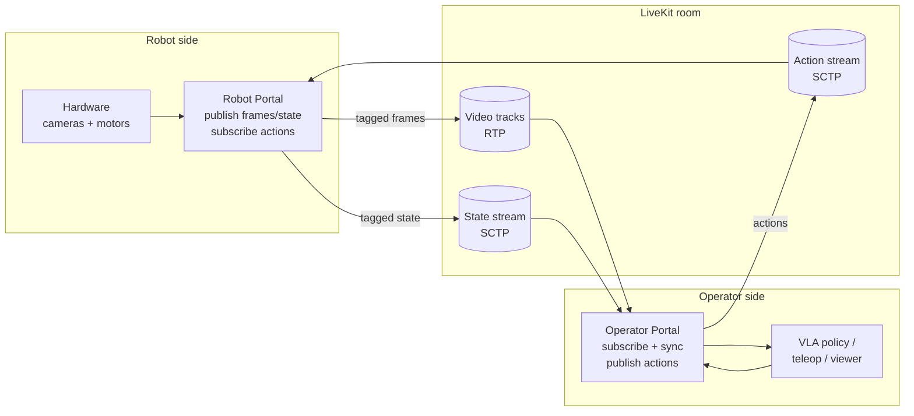
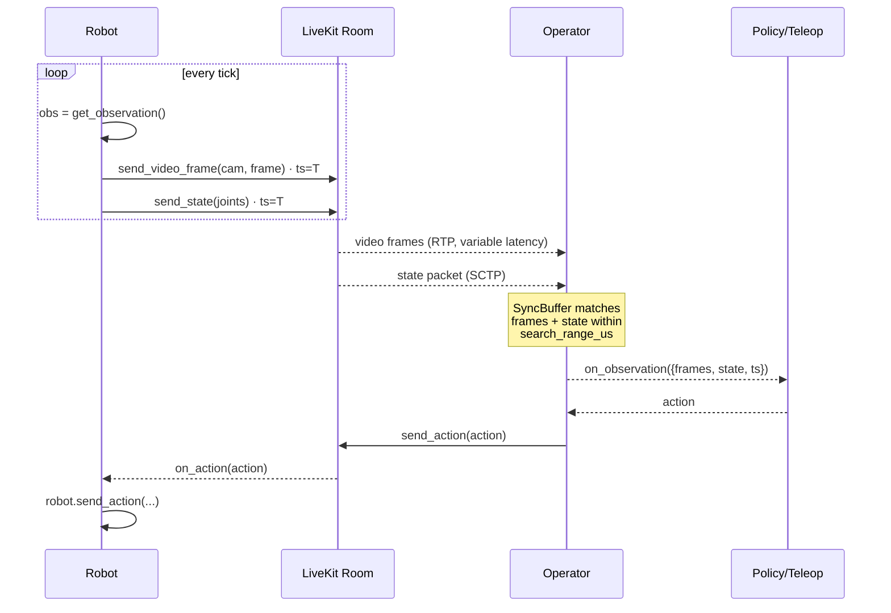

# Concepts

The minimum mental model you need to use Portal. For the match algorithm in
full detail, see [synchronization.md](09-synchronization.md).

## Roles

Portal is a **two-role** system. You instantiate either `Robot` or
`Operator`, configured by `RobotConfig` / `OperatorConfig`. There is one
robot per session and any number of operators (humans teleoperating,
policies running inference, supervisors arbitrating control).

| Class | Publishes | Subscribes |
|------|-----------|------------|
| `Robot` | video frames, state | actions |
| `Operator` | actions | video frames + state → **synced observations** |

Both sides register the same schema via `add_video`, `add_state_typed`, and
`add_action_typed`. Field names, per-field dtypes, and camera names must
match across sides.

The robot listens to one operator at a time, identified by the
`active_operator` pointer. Other operators stream silently and are dropped
at the gate. See [Multi-controller](#multi-controller) for the full
mechanics.

## The observation model

Robotics policies expect a single bundled tuple per step:

```
Observation { frames: {cam1: ndarray, cam2: ndarray, ...},
              state:  {joint1: 0.1, joint2: -0.3, ...},
              timestamp_us: int }
```

LiveKit doesn't deliver data that way. Video tracks, state streams, and action
streams each have their own pacing, codec path, and retransmission. On the
wire you see four or more independent event streams arriving out of phase.

Portal tags every outgoing frame and state packet with the **sender's clock**,
then (on the operator side) matches them locally into `Observation`s. An
observation fires only when every registered video track has a frame within
the match window for a given state. Unmatched states are reported separately
via `on_drop`.

## Multi-controller

The robot exposes a single piece of state, `active_operator`, naming the
operator it is currently listening to. Anyone in the room can read or
update it. The robot's attribute is the source of truth. Other operators
can keep streaming actions without affecting the robot — the gate at the
receive site drops anything from a sender that is not active.

```text
+-----------+        +------------------------------+        +-----------+
| operator  | -----> |                              | <----- | operator  |
| policy-v1 |        |  robot (active_operator =    |        | human-id  |
+-----------+        |             "policy-v1")     |        +-----------+
                     |                              |
                     |  on_action(...) fires only   |
                     |  for "policy-v1". Actions    |
                     |  from "human-id" are dropped |
                     |  silently at the gate.       |
                     +------------------------------+
```

Handoff: a human runs `await op.set_active_operator("human-id")` to
preempt; from then on the robot accepts the human's actions and drops the
policy's. Either side (robot or operator) can call this; the operator
form sends an RPC to the robot which then writes its own attribute.

When the active operator disconnects, the pointer **stays pinned** so a
reconnect with the same identity resumes control. To reassign, anyone in
the room can call `set_active_operator("...")` with a new identity.

Mechanics, edge cases, and the full set of methods live in
[Portal API: Multi-controller](03-portal-api.md#multi-controller-and-active_operator).

## End-to-end picture



## Per-tick flow



## Synchronization in short

For a head state with timestamp `S`, a frame at timestamp `F` on track `k` is a
**candidate** iff `|S − F| < search_range`. Per state, Portal picks the
*nearest* candidate per track and resolves the state one of three ways:

- **Match**: every registered track has an in-range frame, so the
  `Observation` is emitted via `on_observation`.
- **Wait**: at least one track has no candidate yet, but its newest frame is
  still below the horizon (`buf.back().ts < S + R`). Newer frames may still
  land in range.
- **Drop**: some track's newest frame is already past the horizon
  (`buf.back().ts ≥ S + R`). No future frame can match (timestamps are
  monotonic), so the state is fired on `on_drop`.

The search range and buffer sizes derive from a single `fps` knob plus a
`slack` and `tolerance`. See [tuning.md](06-tuning.md).

For the full algorithm (cursor rewind, blocker-gated sync, O(1) drop
detection, eager cross-track drop), see
[synchronization.md](09-synchronization.md).

### Sender requirement

Every received video frame must carry `user_timestamp` in its LiveKit
packet-trailer metadata. Portal enables this automatically on tracks it
publishes (`PacketTrailerFeatures.user_timestamp = true`). A subscribed track
produced by anything that does *not* set this field is unsupported: either
republish the source through Portal, or enable user-timestamp trailers on the
upstream publisher.

## Video frame format

`send_video_frame` expects packed **RGB24**: byte order `R, G, B`, one byte
per channel, no alpha. Layout is row-major and tightly packed
(`stride = width * 3`), so an exact buffer is `width * height * 3` bytes.
`width` and `height` must both be **even** (I420 chroma subsampling).

This matches NumPy `uint8` arrays of shape `(H, W, 3)` in RGB order, which is
what `PIL.Image.convert("RGB")` or OpenCV's `cvtColor(frame, COLOR_BGR2RGB)`
produces.

Portal converts to I420 internally via libyuv's SIMD-optimized `RAWToI420`
before handing the frame to WebRTC. Approximate cost on modern ARM64 (NEON)
or x86 (AVX2):

| Resolution | Per-frame | At 30 fps |
|---|---|---|
| 640×480 | ~0.3–0.9 ms | ~1–3% of a core |
| 1280×720 | ~1–3 ms | ~3–10% |
| 1920×1080 | ~2–6 ms | ~6–20% |

If your camera already produces I420/NV12, you're paying for a round-trip.
For RGB/BGR sources (most cameras + most Python pipelines), this is as fast
as doing the conversion yourself.

## Callbacks and threading

Callbacks registered via `portal.on_observation(...)`, `portal.on_action(...)`,
etc. fire on the asyncio loop that was running when you registered them.
User code never runs on the tokio worker thread.
