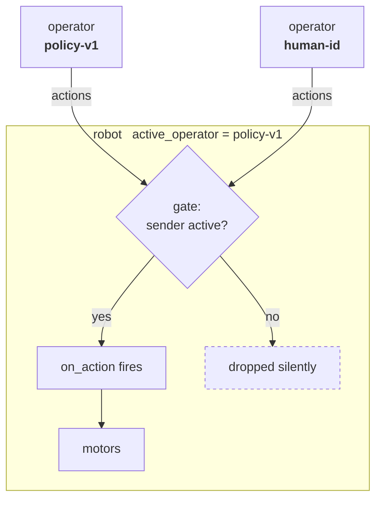
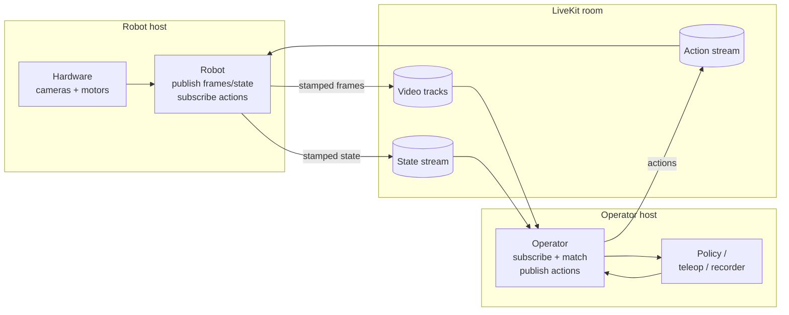
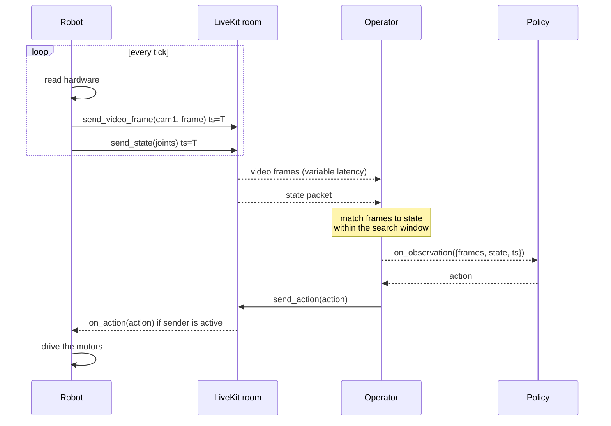

# Concepts

> The mental model behind Portal. Roles, observations, and control handoff.

Four ideas cover almost everything. There are two roles. The robot publishes,
operators subscribe. Observations arrive pre-fused. One operator holds control
at a time.

This page explains each one. It is the shortest path to understanding what
Portal actually does for you.

## Roles

Portal has exactly two roles, and you pick one by choosing a class.

| Class | Publishes | Subscribes to |
|---|---|---|
| `Robot` | video frames, state | actions |
| `Operator` | actions | video frames and state, fused into observations |

There is **one robot per session**. There can be **any number of operators**.
A human teleoperating, a policy running inference, a recorder logging data, and
a supervisor routing control are all operators in the same room.

Both sides declare the same schema, using `add_video`, `add_state_typed`, and
`add_action_typed`. Camera names, field names, field order, and per-field
dtypes must all match. A mismatch is detected and the traffic is dropped, so
this is the first thing to check when nothing arrives.

Role is fixed at construction. Calling `send_action` on a `Robot` raises
`PortalError.WrongRole`.

## The observation model

This is the part Portal exists for.

A robotics policy wants one bundle per step: "at time T, here are my camera
frames and my joint readings." That is the shape your model already consumes.

LiveKit does not deliver data that way, and neither does any other transport.
Video rides an encoder, a congestion-controlled channel, and a decoder. State
packets ride a data channel with none of that. On the receiver they surface as
separate event streams arriving out of phase. Video typically runs 30 to 80 ms
behind a state packet stamped at the same instant.

Portal closes that gap. Every outgoing frame and state packet carries the
**sender's clock**. On the operator side, a per-session buffer matches them by
that timestamp and hands you one object:

```python
Observation(
    frames={"cam1": VideoFrameData, "wrist": VideoFrameData},
    state={"j1": 0.1, "j2": -0.3, "gripper": True},
    timestamp_us=1717171717000000,
)
```

An observation fires only when **every** declared video track has a frame close
enough to that state. States that never find a match are reported separately
through `on_drop`.

`obs.state` holds Python-native types per your declared dtypes. A `BOOL` field
is a real `bool`, an `I8` field is an `int`. `obs.raw_state` gives you the same
data as all-`float` if you would rather write straight into a NumPy buffer.

Each `VideoFrameData` carries packed RGB24 bytes in `.data`, plus `.width`,
`.height`, and `.timestamp_us`. Convert it with the shipped helper:

```python
from livekit.portal import frame_bytes_to_numpy_rgb

rgb = frame_bytes_to_numpy_rgb(bytes(frame.data), frame.width, frame.height)
# rgb is uint8, shape (H, W, 3), RGB order.
```

> **Note.** The helper returns a zero-copy view over the frame bytes. Call
> `.copy()` before mutating it.

### Matching, in one paragraph

For a state at timestamp `S`, a frame at `F` on a given track is a candidate if
`|S - F|` is under the search window. Portal picks the nearest candidate per
track. Then one of three things happens.

- **Match.** Every track had a candidate. The observation fires.
- **Wait.** Some track has nothing in range yet, but newer frames could still
  land in range. Portal holds the state.
- **Drop.** Some track's newest frame is already past the window. Timestamps
  only move forward, so no future frame can match. `on_drop` fires.

The window comes from two knobs, `fps` and `tolerance`, and defaults to 50 ms.
See [Tuning](04-tuning.md) for how to change it and
[Synchronization](reference/synchronization.md) for the full algorithm.

### Handling drops

`on_drop` receives a **list** of state dicts, not a single state. Each dict has
the same shape as `obs.state`. There is no timestamp on them.

```python
def on_drop(dropped):
    # dropped is List[Dict[str, bool | int | float]]
    print(f"lost {len(dropped)} states")

op.on_drop(on_drop)
```

A few drops at startup are normal while video warms up. A steady stream of them
means the match window is too tight or a camera is behind. See
[Troubleshooting](08-troubleshooting.md#sync-drop).

## Control handoff

The robot listens to exactly one operator at a time. Which one is named by a
single piece of state the robot publishes, the **active operator**.


```mermaid
flowchart TD
    P["operator<br/><b>policy-v1</b>"]
    H["operator<br/><b>human-id</b>"]

    G{"gate:<br/>sender active?"}

    P -- actions --> G
    H -- actions --> G

    G -- "yes" --> OK["on_action fires"]
    G -- "no" --> DROP["dropped silently"]

    OK --> M["motors"]

    subgraph R["robot &nbsp; active_operator = policy-v1"]
        G
        OK
        DROP
        M
    end

    style DROP stroke-dasharray: 4 4
```

Everyone in the room can read the pointer and everyone can change it. The
robot's copy is the source of truth.

Handoff is one call, from any participant:

```python
# A human preempts the policy.
await human.set_active_operator(human.local_identity())

# ... teleoperate for a while ...

# Hand control back.
await human.set_active_operator("policy-v1")
```

The robot's stream of executed actions is continuous across that cutover. There
is no reconnect and no renegotiation.

Three behaviors are worth knowing up front.

**The pointer starts unset.** A fresh robot has no active operator and drops
every action it receives. Your first operator has to claim control, or nothing
moves. This is the most common first-run surprise.

**Inactive operators get no feedback.** Their `send_action` calls succeed and
the packets reach the robot, which drops them. There is no error and no
callback. Read `op.active_operator()` if you need to know whether you are being
honored.

**The pointer stays pinned on disconnect.** If the active operator drops off,
the robot keeps pointing at that identity so a reconnect resumes control. To
move it, someone has to call `set_active_operator` with a new identity.

Full mechanics and the callback list are in
[Portal API](03-portal-api.md#the-active-operator).

## Putting it together


```mermaid
flowchart LR
    subgraph Robot["Robot host"]
        H[Hardware<br/>cameras + motors]
        RP[Robot<br/>publish frames/state<br/>subscribe actions]
        H --> RP
    end

    subgraph Cloud["LiveKit room"]
        V[(Video tracks)]
        S[(State stream)]
        A[(Action stream)]
    end

    subgraph Operator["Operator host"]
        OP[Operator<br/>subscribe + match<br/>publish actions]
        M[Policy /<br/>teleop / recorder]
        OP --> M
        M --> OP
    end

    RP -- stamped frames --> V
    RP -- stamped state --> S
    A --> RP

    V --> OP
    S --> OP
    OP -- actions --> A
```

One tick, end to end:


```mermaid
sequenceDiagram
    participant R as Robot
    participant L as LiveKit room
    participant O as Operator
    participant M as Policy

    loop every tick
        R->>R: read hardware
        R->>L: send_video_frame(cam1, frame) ts=T
        R->>L: send_state(joints) ts=T
    end

    L-->>O: video frames (variable latency)
    L-->>O: state packet

    Note over O: match frames to state<br/>within the search window

    O-->>M: on_observation({frames, state, ts})
    M-->>O: action
    O->>L: send_action(action)
    L-->>R: on_action(action) if sender is active
    R->>R: drive the motors
```

## Video frame format

`send_video_frame` expects packed **RGB24**. Byte order is `R, G, B`, one byte
per channel, no alpha. The layout is row-major and tightly packed, so
`stride = width * 3` and an exact buffer is `width * height * 3` bytes.

That is exactly a NumPy `uint8` array of shape `(H, W, 3)` in RGB order, which
is what `PIL.Image.convert("RGB")` and OpenCV's
`cvtColor(frame, COLOR_BGR2RGB)` give you.

**Width and height must both be even.** I420 chroma subsampling requires it.
Odd dimensions raise `PortalError.InvalidFrameDimensions`.

On the default WebRTC path, Portal converts RGB to I420 using libyuv's SIMD
routines before handing the frame to WebRTC. Rough cost on modern ARM64 (NEON)
or x86 (AVX2):

| Resolution | Per frame | At 30 fps |
|---|---|---|
| 640x480 | 0.3 to 0.9 ms | 1 to 3% of a core |
| 1280x720 | 1 to 3 ms | 3 to 10% |
| 1920x1080 | 2 to 6 ms | 6 to 20% |

If your camera already produces I420 or NV12, you are paying for a round trip.
For RGB and BGR sources, which covers most cameras and most Python pipelines,
this is as fast as converting it yourself.

If a policy reads those pixels, the lossy WebRTC path may not be acceptable at
all. See [Frame video](05-frame-video.md).

### Frames must carry a timestamp

Every video frame Portal receives must carry `user_timestamp` in its LiveKit
packet-trailer metadata. Portal sets this automatically on tracks it publishes.

A subscribed track from a publisher that does **not** set it cannot be matched
and is unsupported. Either republish the source through Portal, or enable
user-timestamp trailers on the upstream publisher. The
[wire protocol](reference/wire-protocol.md#webrtc-video-tracks) page has the
detail if you are writing your own publisher.

## Callbacks and threading

Callbacks you register with `on_observation`, `on_action`, and friends fire on
the asyncio loop that was running when you registered them. Your code never
runs on the tokio worker thread.

That means a slow callback stalls your own loop, not Portal's internals. It
does still cost you frames, because the per-track receive path sheds frames
when processing falls behind. Keep callbacks short and move heavy work
elsewhere. See [`recv-overflow`](08-troubleshooting.md#recv-overflow).

If a callback raises, Portal catches it, logs it under
[`callback-panic`](08-troubleshooting.md#callback-panic), and keeps the session
alive. It cannot tell you the line number, so wrap the body in `try` and
`except` while debugging.

## Next steps

- [Portal API](03-portal-api.md). Every method, with the gotchas.
- [Tuning](04-tuning.md). The knobs behind the match window.
- [Metrics](07-metrics.md). What to watch in production.
- [Synchronization](reference/synchronization.md). The full matching algorithm.
