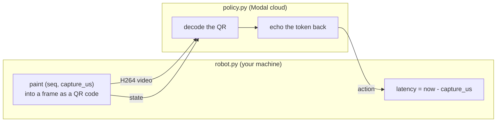

# Modal mock inference

In this tutorial we walk you through running a mock policy with `livekit-portal`
on [Modal](https://modal.com). The example creates synthetic video frames and
measures round-trip glass-to-glass latency, the full loop from a pixel leaving
the robot to the matching action coming back.

The policy is a mock. It reads a QR code instead of running a real model, so the
tutorial stays focused on how to run a policy on Modal. When you have a real
policy, it drops straight in (see [step 6](#step-6-swap-in-a-real-policy)).

## The idea in one picture



The timestamp is painted into the picture, so it travels through the real
video encoder and jitter buffer. That is what makes the number glass-to-glass
and not just a network ping.

## What you need

- A [LiveKit Cloud](https://cloud.livekit.io) project (free tier is fine). The
  policy runs in the cloud and dials out, so `localhost` will not work.
- Python 3.12 and [`uv`](https://docs.astral.sh/uv/).
- A [Modal](https://modal.com) account.

---

## Step 1: Install everything

`uv sync` reads `pyproject.toml` and installs Portal, Modal, and the rest into
a local `.venv`.

```bash
uv sync
```

## Step 2: Connect the Modal CLI to your account

This opens a browser once to link the CLI. You only do it a single time.

```bash
uv run modal setup
```

## Step 3: Give the cloud policy its LiveKit credentials

The policy runs on Modal, so it needs your LiveKit keys there. A **Modal
secret** is the standard way to hand credentials to a cloud function. Modal
injects each `KEY=VALUE` into the policy as an environment variable.

Grab your URL and keys from the LiveKit Cloud dashboard, then:

```bash
uv run modal secret create livekit-credentials \
    LIVEKIT_URL=wss://your-project.livekit.cloud \
    LIVEKIT_API_KEY=API... \
    LIVEKIT_API_SECRET=...
```

The name `livekit-credentials` is what `policy.py` looks up. Keep it as is.

Check it later with `uv run modal secret list`. Delete it with
`uv run modal secret delete livekit-credentials`.

## Step 4: Point the local robot at the same project

The robot reads its credentials from a local `.env` file. Copy the template
and fill in the **same** URL and keys you put in the secret.

```bash
cp .env.example .env
```

Both sides default to the room `portal-modal-mock`, so they will find each
other automatically.

## Step 5: Run it

Start the policy on Modal. The first run builds the image, which takes a
minute. After that it connects and waits for a robot.

```bash
uv run modal run policy.py
```

In a second terminal, start the robot.

```bash
uv run robot.py
```

They meet in the LiveKit room and the robot starts printing latency.

---

## Reading the output

The policy prints how many frames it decoded:

```
[policy] decoded=142 missed=1 decode_rate=99%
```

The robot prints the measurements once a second:

```
[robot] t= 4s sent=75 replies=71 dropped=4 glass2glass=88.40ms codec_lag=12.10ms e2e=91.20ms/128.6ms active=policy
```

What each field means:

- **`sent`** frames the robot has published.
- **`replies`** decoded tokens that came back from the policy.
- **`dropped`** frames that never made the round trip. A `seq` gap means the
  frame was lost in the video pipe or its QR was too degraded to read. This is
  real frame loss the video layer normally hides.
- **`glass2glass`** the full video round trip, `now - capture_us`. This is the
  headline number.
- **`codec_lag`** how much later the camera frame arrived than the joint state
  for the same tick, measured on the policy. Portal pairs a frame and a state
  by the capture time the robot stamped, so the video's extra delay does not
  show up as a timestamp gap. It shows up as the observation firing later than
  the raw state. That gap is the one-way cost of pushing pixels through the
  video codec and jitter buffer, on top of the plain data channel.
- **`e2e`** the same glass-to-glass latency, aggregated by Portal as
  `metrics.policy.e2e_us_p50/p95`. Watch the p95: control cares about the tail,
  not the average.

Latency depends on the distance to the Modal region and your uplink. A
cross-continent run will show a larger `e2e`.

## Step 6: Swap in a real policy

The mock is CPU-only. To run a real model, change two things and leave the
operator loop alone.

**1. Give the Modal function a GPU** in `policy.py` and install your model:

```python
image = image.pip_install("lerobot", "torch")   # your stack

@app.function(image=image, secrets=[...], gpu="A10G", timeout=3600)
def run_on_modal():
    ...
```

**2. Replace the `Policy` class** in `policy.py`. It already has the LeRobot
call shape:

```python
class Policy:
    def __init__(self):
        self.model = ACTPolicy.from_pretrained("your-org/your-checkpoint")

    def get_action(self, obs):
        return self.model.select_action(obs)   # your real forward pass
```

For getting a checkpoint onto the GPU, see the
[LeRobot plugin docs](../../../docs/10-lerobot.md).

## The wire contract

The shared schema (video track, state and action fields, fps) lives in
`portal.yaml`. Both sides load it with `RobotConfig.from_yaml_file` and
`OperatorConfig.from_yaml_file`, so there is one place to edit and no chance of
the two drifting apart. To switch the camera to a lossless codec, for example,
change `codec: h264` to `codec: png` there.

## Knobs

Frame size and run length are constants at the top of `robot.py`: `WIDTH`,
`HEIGHT`, `DURATION_S`, and `FPS` (keep `FPS` matching `fps` in `portal.yaml`).

If `dropped` climbs or `decode_rate` falls, the QR is getting mangled before
the plain video would. Raise `WIDTH`/`HEIGHT`, or set `codec: png` in
`portal.yaml` for a lossless comparison. See
[frame video](../../../docs/05-frame-video.md).
